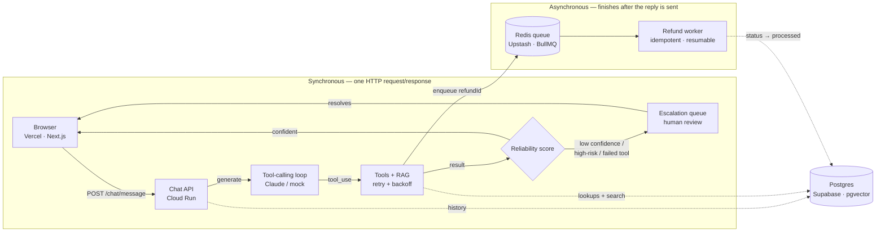

# Reformly Copilot — Case Study

An AI support agent that decides for itself when it shouldn't decide alone.

**Live app:** https://web-mu-kohl-77.vercel.app
**API:** https://reformly-api-721473915245.asia-south1.run.app

Order status, refunds, and subscription changes for a fitness-equipment subscription business, handled by an LLM with real tool-calling, backed by a confidence score that routes anything risky or uncertain to a human before it ever reaches the customer.

## Tech stack, and why

Nothing here is a default choice — each tool earns its place against something the system actually needs to do.

### Application

| Tech | Role | Why |
|---|---|---|
| NestJS | Backend framework | Structured, dependency-injected modules for a system with real seams — LLM, tools, RAG, jobs, reliability, and escalation all need to stay independently testable, not tangled in one Express file. |
| PostgreSQL | Data | Orders, subscriptions, conversations, and audit trails are all genuinely relational — this isn't a document-shaped problem. |
| pgvector | RAG | Runs the knowledge-base similarity search inside the same Postgres instance as the transactional data. One database instead of a database plus a separate vector store to keep in sync. |
| Prisma | ORM | Typed schema and migrations, with a raw-SQL escape hatch for the one thing it doesn't model natively: the pgvector column and its cosine-distance queries. |
| BullMQ + Redis | Background jobs | Refund settlement shouldn't block a chat reply on a slow payment processor. Jobs are keyed so a retried or duplicate enqueue is a no-op, not a double refund. |
| Claude (tool-calling) | LLM | The model calls real tools — order lookup, refund eligibility, KB search — instead of free-text answers. A dedicated `submit_final_response` tool forces a validated reply shape. |
| Zod | Validation | The model's structured output is re-validated on the server regardless of what the API claims — a malformed call gets fed back as an error and retried, not trusted. |
| Next.js + Tailwind | Dashboard | A chat tester, an escalation review queue, and a cost/reliability dashboard — three small screens that don't need more than the App Router gives for free. |
| Sentry | Observability | No-op with no DSN configured, so the whole app runs and tests locally without an account — one env var away from real error tracking in production. |

### Infrastructure & delivery

| Tech | Role | Why |
|---|---|---|
| Docker | Packaging | One reproducible image for the API, built from the repo root so npm workspaces resolve correctly, that runs identically on a laptop and on Cloud Run. |
| Google Cloud Run | Backend host | Serverless containers billed by usage. Scales to zero when idle, and can hold one CPU-always-allocated instance when the background worker needs to actually run. |
| Vercel | Frontend host | Next.js's native platform — zero-config builds, instant production URLs. Splitting hosting from the API doesn't add real complexity; it removes Next.js-specific configuration from GCP instead. |
| Supabase | Managed Postgres | Postgres with pgvector enabled out of the box, so the database and the RAG store are provisioned together, not stitched from two vendors. |
| Upstash | Managed Redis | Serverless Redis reachable over TLS from anywhere, sized for a queue that handles one refund job at a time, not a cache under real load. |
| GitHub Actions | CI | Every push builds against real Postgres and Redis service containers and runs the Prisma migration for real, so "it migrates" is verified, not assumed. |

## Architecture

How a message actually moves through the system: one request triggers two things at once — an answer for the customer, and, if a refund is involved, a background job that finishes independently of the chat reply.

1. **The model can't just answer.** Every turn must end by calling a `submit_final_response` tool carrying a confidence number, not free text — that's what makes the next step possible.
2. **Confidence is computed, not trusted.** The model's own number is blended 60/40 with whether its tool calls actually succeeded. A model that "sounds sure" after a failed lookup still gets overridden.
3. **Risk beats confidence.** Anything that touches billing (pausing a subscription) is escalated to a human automatically, regardless of how confident the model is.
4. **Money moves off the request path.** Refund eligibility is decided synchronously; the payment-processor call happens in a queued job so a slow provider never makes the chat hang.
